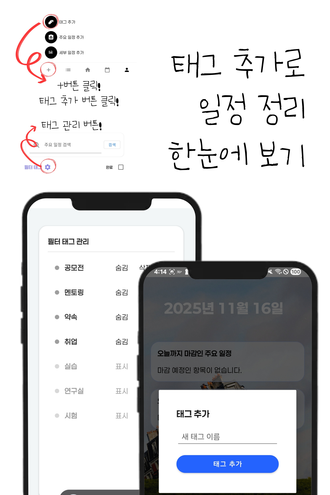
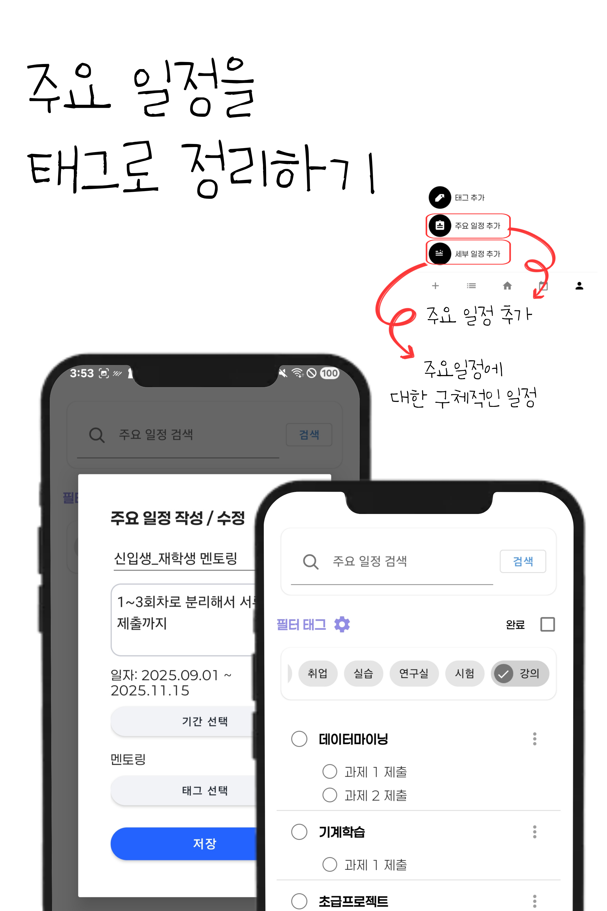
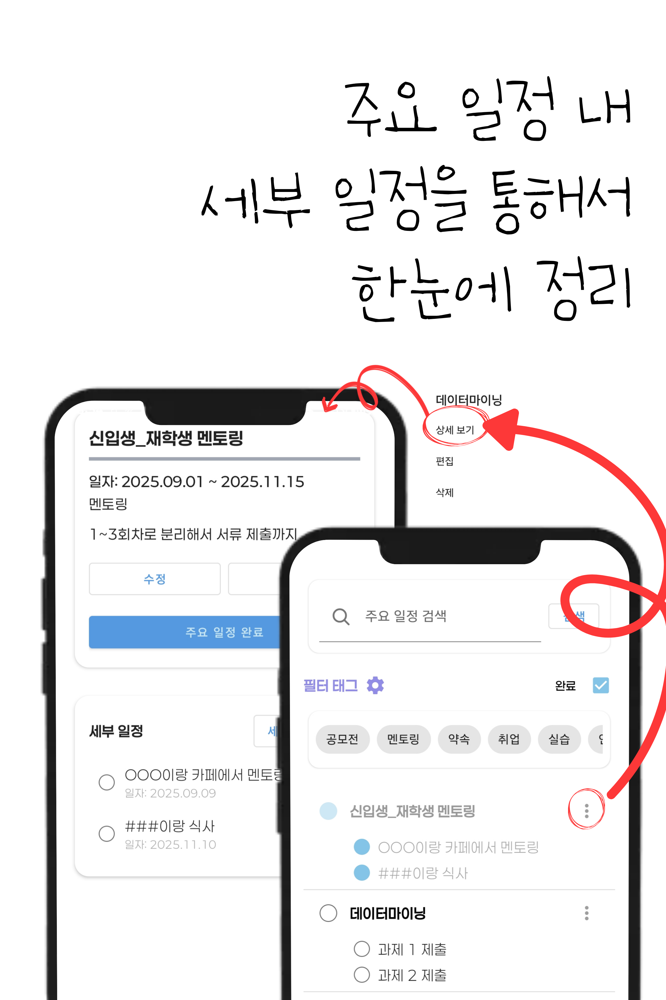
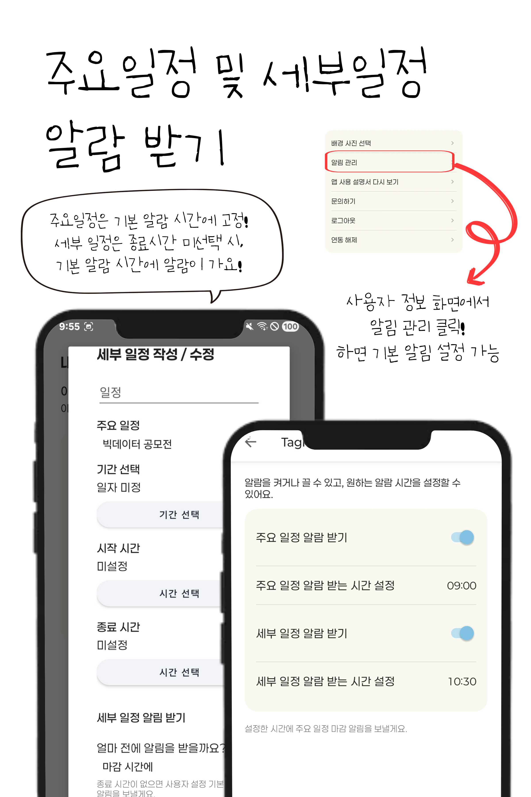

# Tagmoa

일이 많을수록 더 단순하게. 태그로 정리하는 가장 깔끔한 할 일 관리 앱.

Tagmoa는 복잡해지는 할 일들을 태그 중심으로 구조화해 한눈에 정리할 수 있도록 도와주는 일정·작업 관리 앱입니다. 프로젝트가 여러 개여도, 해야 할 일이 많아도, 무엇부터 해야 할지 헷갈리지 않도록 ‘태그 → 메인 테스크 → 서브 테스크’ 흐름으로 깔끔하게 정돈해줍니다.

---

## ✨ Tagmoa가 해결하는 문제

- ✔ **프로젝트별로 할 일이 섞여 정신없던 경험**  
  → 태그 기반 분류로 프로젝트·업무별 흐름을 한눈에 확인
- ✔ **큰 일과 작은 일이 뒤섞여 우선순위를 놓치는 상황**  
  → “메인 테스크 → 서브 테스크” 구조로 큰 그림부터 세부 작업까지 자연스럽게 정리
- ✔ **일정이 많아질수록 어떤 일이 어디에 속하는지 헷갈리는 문제**  
  → 색상, 날짜, 태그를 통해 직관적으로 파악

---

## 💡 Tagmoa의 핵심 경험

### 1. 태그로 묶어서 정리하는 업무 흐름
“업무 분야”, “프로젝트”, “테마” 등 원하는 기준으로 태그를 만들고 모든 작업을 직관적으로 묶어서 관리할 수 있습니다.  
예: 디자인 / 개발 / 회의 / 학교 / 개인 / 사이드 프로젝트...  
한 태그만 봐도 “지금 내가 해야 할 일”의 전체 그림이 나타납니다.

### 2. 메인 테스크로 큰 줄기 파악
메인 테스크는 하나의 ‘큰 작업’ 또는 ‘프로젝트 단위’를 의미합니다.  
예: “앱 온보딩 페이지 개선”, “중간고사 준비”, “포트폴리오 리뉴얼”  
메인 테스크만 봐도 이번 주의 핵심 목표가 자연스럽게 정리됩니다.

### 3. 서브 테스크로 작은 일까지 빠짐없이
큰 작업을 세부 단계로 나누면 “지금 바로 해야 할 일”이 명확해집니다.

- 인터뷰 준비하기
- 문서 정리
- 자료 수집
- 초안 작성
- 검토하기

작은 일들을 체크해가며 자연스럽게 작업이 완성되는 경험을 제공합니다.

### 4. 색상·날짜·중요도로 더 명확하게 구분
각 테스크는 색상 라벨, 날짜, 중요도를 지정해 보다 시각적이고 명확하게 정리할 수 있습니다.

- 색상: 프로젝트나 우선순위 구분
- 날짜: 시작/종료/마감일로 작업 타임라인 파악
- 중요도: 지금 당장 해야 할 일부터 표시

---

## 📱 Tagmoa 화면 미리보기

  
<strong>▶ 온보딩 이미지 보기 (가로 스크롤)</strong>

  

    
    
    
    
    
    
  

---

## 🌱 Tagmoa가 추구하는 방향

Tagmoa는 ‘일정 관리’보다 **‘일 정리’**에 집중합니다.  
사용자가 지금 집중해야 할 일을 더 빠르게 찾고, 작업 흐름이 자연스럽게 이어지도록 만드는 것이 목표입니다.

앞으로는 더 똑똑한 추천, 간단한 업무 분석, 태그 기반 통계 등을 통해 일상을 더 효율적으로 만드는 방향으로 확장할 예정입니다.

---

## 🧡 Tagmoa를 추천하는 사람

- 여러 프로젝트를 동시에 진행하는 사람
- 해야 할 일은 많은데 무엇부터 해야 할지 헷갈리는 사람
- 관리 방식이 복잡한 앱 대신 단순하고 직관적인 구조를 원하는 사람
- 큰 작업과 작은 작업을 구분해 정리하고 싶은 사람

---

Tagmoa와 함께 일의 흐름을 태그로 붙잡고, 해야 할 일을 더 단순하게 관리해 보세요!
